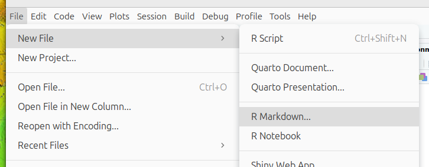
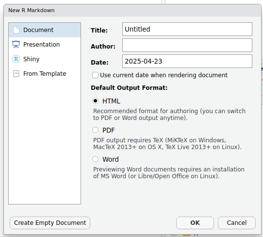
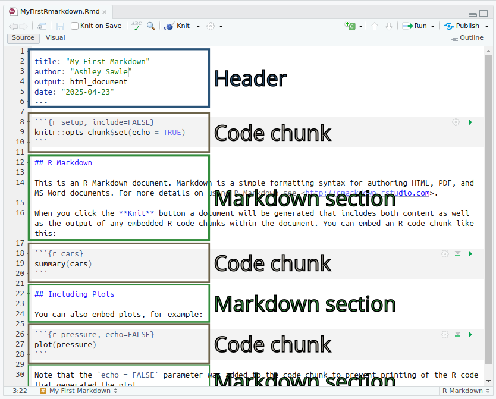
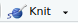
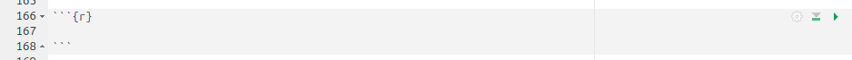
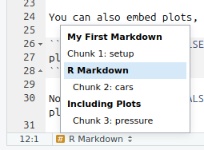

> #### Learning objectives
>
> -   Learn how to generate an html/pdf report using Rmarkdown and
>     Rstudio

# What is R Markdown?

R Markdown provides a means of combining executable R code, code output
and textual content in a single document. This documents can then be
used to create report in a variety of different formats, such as PDF,
HTML or even Word. R Markdown can be used to create static reports or
slides.

The session will provide a brief introduction to R Markdown, including how to
create a new R Markdown document, how to add text and images, how to
insert R code chunks, and how to render the document to create a report.

More detailed materials can be found 
[here](https://rmarkdown.rstudio.com/index.html).

# Packages for this session

We will be using the following packages in this session. If you don't
have them installed, you can do so using the `install.packages()` function.


```{r, message=FALSE}
library(tidyverse)
library(knitr)
library(kableExtra)
library(DT)
library(patchwork)
```

`knitr` is the package that is used to convert R Markdown documents to
various output formats. It is also used to control how the output of R code is
rendered in the document, and its `kable` function is used to create tables in R
Markdown documents. Note that you don't need to load the `knitr` package
explicitly, as it is loaded automatically when you create an R Markdown, but if
you want to use the `kable` function you may wish in order not to have to type
`knitr::kable()` every time.

The `kableExtra` package extends the functionality of `knitr`, providing
additional functions for formatting tables. The `DT` package provides a way to
create interactive tables in R Markdown documents. The `patchwork` package
provides a way to combine multiple ggplots into a single figure.

# Creating an R Markdown document

We can start a new R Markdown document in RStudio from the menu bar:

`File` --\> `New File` --\> `R Markdown...`



This will bring up the following diaglogue box:



Change the title to something meaningful, add your name as the author if
you wish, select the type of document you want the markdown to generate
(this can be changed later) and then click `OK` to create a starter
script.

Save the starter script as `MyFirstRmarkdown.Rmd`.

# The basic components of an R Markdown

An R Markdown file is made up of 3 components:

- Header - metadata and instructions related to rendering the document
- Markdown sections - Text, images, links, tables, lists to be
  included in the report
- R code chunks - Code chunks to be executed and the output included
  in the report



You may have noticed that opening an R Markdown (`.Rmd`) document caused
a few new icons to appear on the toolbar above the script window. For
now just click:



This will convert (or *render*) the document to html format.

In this session we will generate an HTML file, however, it is possible
to generate a range of different document types, and these are
extensible to link multiple documents into "books" or websites. We'll
keep it simple for this introduction. Let's look at each section in a
little more detail.

# Header

The R markdown document starts with a header in [YAML
format](https://yaml.org/).

The header begins and ends with a line with three hyphens (`---`). The
only required field is the `output` field, which defines what type of
document is to be created. Other fields either define metadata, e.g.
`author` or `title`, or they contain information related to the
rendering of the output document, e.g. whether to include a table of
contents or not (we'll look at this later).

In the example below the `title`, `author`, `output` and `date` have
been specified

```         
---
title: "My First Markdown"
author: "Ashley Sawle"
output: html_document
date: "2025-04-23"
---
```

# Markdown sections {#markdown-header}

Markdown is a markup language that allows you to add formatting to text,
such as bold or italics. Unlike in a word processor such as MS Word, the
effect of formatting is not visible in a markdown (.md) document, only
once the document is rendered to create the output. Markdown uses specific
syntax to add formats to the text. The benefit of this is Markdown is
lightweight and platform independent.

R Markdown combines normal Markdown for text and images with separate
chunks thank can contain executable R code, the outputs of which can be
included in the document.

The full documentation of the Markdown syntax can be found
[here](https://www.markdownguide.org/). Here we will concentrate on the
most commonly used elements.

## Inline text formatting

Seeing as we have already mentioned **bold** and *italics*, let's see
how they work. To apply inline formatting for text, we simply surround
the text we want to format with a particular set of symbols. For example
to render some text in *italics* we surround the text with either
asterisks or underscores:

`This is *italics*` or `This is _italics_` → This is *italics*

Other possible inline formatting syntax includes:

-   Double asterisks/underscores for **bold**:

    `This **is bold**` or `This __is bold__` → This **is bold**

-   Tilde (`~`) for subscript:

    `This is ~subscript~` → This is ~subscript~

-   Caret (`^`) for superscript:

    `This is ^superscript^` → This is ^superscript^

-   Double tilde (`~`) for strikethrough:

    `~~This is strikethrough~~` → ~~This is strikethrough~~

-   Backticks (`` ` ``) for "code" font:

    `` This is `code` `` → This is `code`

Note that any amount of text can come between the two sets of syntax.

## Headings

Section headings are created using the `#` symbol (technically called an
octothorp!) at the beginning of the line. The top level is the document
title and uses one `#`:

`# Section`


Using 2 creates a section header:

`## Sub-section` → [Sub-section]{style="font-weight:500; font-size:20px"}

Increasing the number of `#` symbols creates deeper and deeper levels of
sub-sections.

```         
# Section
# Sub-section
## Sub-sub section
### Sub-sub-sub section
#### Sub-sub-sub-sub section
```

### Adding a table of contents

The section headers can be automatically added to a table of contents.
As this is "instructions related to rendering the document", we need to
add this information to the head yaml:

```         
output:
  html_document:
    toc: true
```

By default all headings up to level 3 headings are displayed in the
table of contents. You can adjust this by specifying `toc_depth`. Also,
the table of contents will default to a "static" list under after title
matter of the document. With html format we could instead have a
"floating" (and collapsible) table of contents that stays on view on the
left of the document body as the document is scrolled. To implement
these we add two additional lines to the yaml:

```         
output:
  html_document:
    toc: true
    toc_depth: 4
    toc_float: true
```

### Tab sets

A neat thing to do with headers and sub-headers is to create tab sets.
If we add the syntax {.tabset} after a header, all subsequent
sub-headers on the next level down will be rendered as tabs, rather than
just consecutive text. For example:

```         
### Some different formattings {.tabset}

The following tabs show different inline formatting syntax.

#### Bold

Bold is achieved with double asterisks e.g. `**bold**` is rendered as **bold**.

#### Italics

Italics is achieved with a single asterisk e.g. `*italics*` is rendered as *italics*.

#### Strikethrough {.unlisted .unnumbered}

Strikethrough is achieved with two tildes e.g. `~~strikethrough~~` is rendered as 
~~Strikethrough~~.

### Next section

The tab set ends when we return to a higher header level.
```

is rendered as:

<div class="renderedblock">

### Some different formattings {.tabset .unlisted .unnumbered}

The following tabs show different inline formatting syntax.

#### Bold {.unlisted .unnumbered}

Bold is achieved with double asterisks e.g. `**bold**` is rendered as
**bold**.

#### Italics {.unlisted .unnumbered}

Italics is achieved with a single asterisk e.g. `*italics*` is rendered
as *italics*.

#### Strikethrough {.unlisted .unnumbered}

Strikethrough is achieved with tilde e.g. `~strikethrough~` is rendered
as ~Strikethrough~.

### Next section {.unlisted .unnumbered}

The tab set ends when we return to a higher header level.

</div>

**NOTE**: The border and background colour have been added in order to
differentiate the output rendered from the markdown above from the main
text of this document. This is not part of the default output. 

## Line breaks

Two consecutive lines of body text in the R Markdown document will be
read as as the same paragraph and concatenated. To insert a line break
between two lines either add two (or more) spaces or a backslash at the
end of the first line. For example:

```         
This is the first line
There are no spaces after the end of the previous line
```

is rendered as:

<div class="renderedblock">
This is the first line There are no spaces after the end of the previous
line
</div>

where as:

```         
This is the first line\
There are no spaces after the end of the previous line
```

is rendered as:

<div class="renderedblock">
This is the first line\
There are no spaces after the end of the previous line
</div>

## Lists

We can create both unordered lists (bullet points) or ordered lists
(numbered).

### Unordered lists

To create an unordered list using `*`, `-` or `+` (all do the same
thing). You can created nested lists by indenting by 4 spaces.

```         
* Cricket
* Rugby
* Football
    * English Premier League
    * La Liga
    * Serie A
* Basketball
* Volleyball
* Hockey
```

is rendered as:

<div class="renderedblock">
-   Cricket
-   Rugby
-   Football
    -   English Premier League
    -   La Liga
    -   Serie A
-   Basketball
-   Volleyball
-   Hockey
</div>

### Ordered lists

Ordered lists can be created using a number for numeric bullets, a lower
case letter for `a`, `b`, `c`...etc., or `i`s for roman numerals. Again
indentation can be used to create nested lists. For example

```         
1. Cat
2. Ferret
3. Dog
    a. Terriers
        i.  Jack Russell
        ii. Airedale
        iii. Yorkshire
        iv. West Highland
    b. Labradors
    c. Spaniels
4. Goldfish
```

is rendered as:

<div class="renderedblock">
1.  Cat
2.  Ferret
3.  Dog
    a.  Terriers
        i.  Jack Russell
        ii. Airedale
        iii. Yorkshire
        iv. West Highland
    b.  Labradors
    c.  Spaniels
4.  Goldfish
</div>

It isn't actually necessary to use particular numbers/letters/roman
numerals in any particular order - the correct order for the bullets
will be determined when the document is rendered. So in fact the
following would results in the same output:

```         
1. Cat
1. Ferret
5. Dog
    a. Terriers
        i.  Jack Russell
        i. Airedale
        i. Yorkshire
        i. West Highland
    b. Labradors
    a. Spaniels
1. Goldfish
```

## Links

As with a standard html web page, we can add hyperlinks, both to
internal sections of the document or to external pages. The general
format for creating a link is to surround the link text (what is
displayed) with square brackets and then follow this with the link
itself (internal tag or external page) surrounded by round backets:

```         
[This is the text](this_is_the_link)
```

### External links

External links can either be to another html document on the same file
system or to a URL elsewhere on the internet.

For example we can link to week 6 documentation, which is in the same
folder as this document:

`[week 6 document](week6.html)` → [week 6 document](week6.html)

Alternatively, we can link to pages elsewhere on the internet, e.g:

`[Hadley Wickham's old R Markdown page](https://r4ds.had.co.nz/r-markdown.html)`
→ [Hadley Wickham's old R Markdown
page](https://r4ds.had.co.nz/r-markdown.html)

### Internal links to sections

We can link to any section of the current document, but first we need to
add a tag to the header for that section. For example, if we want to be
able to link to the top of this Markdown section, we would add a tag to
the header like this:

`## Markdown sections {#markdown-header}`

Then to link to this section in text we would use:

`[link to header](#markdown-header)`

e.g. Follow [this link](#markdown-header) to get to the top of this
section

## Inserting images

Images can be inserted into the document in a number of ways, but the
simplest uses a similar syntax to links, but this time preceded by an
exclamation mark:

``

The link can be a URL to an image elsewhere on the internet or a
relative path to an image on the same file system.

``

inserts the image like this:


This does not give us much control over how the image is rendered. We
can control the size by specifying the width in either absolute display
pixels or the percentage of the document width with the following
syntax:

`{width=10%}`

inserts the image like this:

{width="10%"}

`{width=150px}`

inserts the image like this:

{width="150px"}

## Tables {#tables}

Most tables to appear in your documents will be data generated by R code
chunks, however, on rare occasions we may want to manually include a
table. This can be achieved using the following syntax.

```         
| Name        | Band        |
| ----------- | ----------- |
| Mick        | Stones      |
| John        | Beatles     |
| Paul        | Beatles     |          
```

is rendered as:

<div class="renderedblock">
| Name | Band    |
|------|---------|
| Mick | Stones  |
| John | Beatles |
| Paul | Beatles |
</div>

Table alignments can be done using the following syntax:

```         
| Name  | Band    | Instrument |
| :---  | :----:  |       ---: |
| John  | Beatles | Guitar     | 
| Paul  | Beatles | Bass       |
| Keith | Stones  | Guitar     |
```

This is rendered as:

<div class="renderedblock">
| Name  |  Band   | Instrument |
|:------|:-------:|-----------:|
| John  | Beatles |     Guitar |
| Paul  | Beatles |       Bass |
| Keith | Stones  |     Guitar |
</div>

## Blockquotes

A block quote is often used when we want to quote a piece of text from
another document. This is done by using the `>` symbol at the beginning
of the line. For example:

```         
> "The R language is a free software environment for statistical
> computing and graphics supported by the R Foundation for Statistical
> Computing. The R language is widely used among statisticians and
> data miners for developing statistical software and data analysis."
> (Wikipedia)
```

is rendered as:

> "The R language is a free software environment for statistical
> computing and graphics supported by the R Foundation for Statistical
> Computing. The R language is widely used among statisticians and data
> miners for developing statistical software and data analysis."
> (Wikipedia)

## Code blocks

We have seen that we can highlight text as "code" inline using backticks
`` `code` ``. This is useful for short snippets of code, but if we want
to add a longer piece of code as part of the documentation (i.e. not
code that we want to run, but just to show the reader), we can use a
code block. This is done by surrounding the code with three backticks.
For example:

````         
```
metabric %>%
    group_by(ER_status, Cancer_type) %>%
    summarise(ERBB2_mean = mean(ERBB2)) %>%
    top_n(n = 1)
```
````

This will be rendered as:

```{blocktype = "renderedblock"}         
metabric %>%
    group_by(ER_status, Cancer_type) %>%
    summarise(ERBB2_mean = mean(ERBB2)) %>%
    top_n(n = 1)
```

For code that we actually want to run, we will use R code chunks.

# R code chunks

R code that we want to run during the rendering of document should be
placed in an R code chunk. These sections of R code are executed when
the document is rendered. The results of the code may then be included
in the output document. This allows us to dynamically generate tables,
figures and other output based on the data and code in the document.
This is a powerful feature of R Markdown, as it allows us to create
reproducible reports that can be easily updated with new data or code
changes.

The R code chunk is created by surrounding the code with three backticks
and adding `{r}` after the first three backticks. For example:

```` markdown
`r ''````{r}
x <- 10
y <- 20
x + y
```
````

Generates the following in the output:

```{r}
x <- 10
y <- 20
x + y
```

By default the code is written to a code chunk (we can change this - see [below](#chunk_opts)).
and any output from the code is written underneath. The output might include
anything that would normally be written to the console (such the result of `x +
y` here), tables, plots, or even warnings or errors.

## Creating code chunks

To create a code chunk, you can use the insert icon on the
toolbar:


or you can use the keyboard shortcut `Ctrl + Alt + I` (Windows) or
`Cmd + Option + I` (Mac), or you can type the code chunk manually as
shown above. The code chunk will be created at the location of the
cursor in the document. 

The empty code chunk will look like this:



You'll notice a few icons on the right in the toolbar above the code chunk.
These are used to run the code chunk, run all code chunks above the current
chunk, and to manage chunk options (see below). 

## Running code chunks

To run a code chunk, you can click the green arrow icon in the toolbar
above the code chunk, or you can use the keyboard shortcut `Ctrl + Shift
+ Enter` (Windows) or `Cmd + Shift + Enter` (Mac). This will run the
code in the chunk and display the output below the chunk.

## Chunk options {#chunk_opts}

We can apply a number of options to code chunks to control how they are
rendered in the output document. There are a large number of possible
options the most common of which are:

-   `echo = FALSE` - do not display the code in rendered document, but do display the
    results of the code.
-   `include = FALSE` - do not display either the code or the results in the
    document when it is rendered. The code will still run and so any changes it
    makes to the environment (new objects or changes to existing objects) will
    be available for subsequent code chunks.
-   `message = FALSE` - do not display any messages that are generated
    by the code chunk in the rendered file.
-   `warning = FALSE` - do not display warnings that are generated by
    code chunk in the rendered file.
-   `eval = FALSE` - do not run the code in the chunk, but display
    the code in the rendered document. 
-   `cache = TRUE` - cache the results of the code chunk so that it
    does not need to be re-run every time the document is rendered. This can
    speed up rendering time for large code chunks or when the code takes a long
    time to run. The cache is stored in a folder called `cache` in the same
    directory as the R Markdown file.
-   `fig.width` and `fig.height` - set the width and height of
     figures generated by the code chunk. 
-   `fig.cap` - set the caption for the figure generated by the code
     chunk. This will be displayed below the figure in the rendered document.

A thorough guide to all the avaialable chunk options (and more `knitr` options)
can be found [here](https://yihui.org/knitr/options/).

## Chunk label

We can specify a label for the code chunk by adding it after the `{r}` in
the code chunk header:

```` markdown
`r ''````{r label}
```
````

This has a number of uses. In RStudio you should see a menu in the bottom left
of the script panel:



This gives us a way to navigate through the document and includes any headers and
code chunks with labels. This is very useful for long documents.

## The "setup" chunk

Best practice is to create a "setup" chunk at the beginning of the document.
This chunk should include all the packages that you will need to run the
the code in the document.

The "setup" chunk will also include any options that you want to
set for the entire document. For example, you might want to set the default
chunk options for the entire document to not display code. You can do this
using the `knitr` command `opts_chunk$set()`. For example the set up chunk might
look like this:

````markdown
`r ''````{r setup, message=FALSE}
library(tidyverse)
library(patchwork)
library(knitr)
library(kableExtra)
library(DT)
knitr::opts_chunk$set(warning = FALSE, echo = TRUE)
```
````

The `opts_chunk$set()` function sets the default options for all chunks, in this
case to always display the code and not display any warnings. You can override
these options in individual chunks by specifying the options in the chunk header.

It's good idea to set `message = FALSE` for the setup chunk so that it does not
print all the package startup messages in the rendered document.

### A note on the working directory

When evaluating code chunks, the default working directory is the location of
the R Markdown file. This means that any paths to files you wish to read/write 
need to be relative to that directory. If you wish to use a different working
directory, you can set this in the setup chunk using the following code:

```
projDir <- "/Full/path/to/your/project/directory"
opts_knit$set(root.dir = projDir)
```

## Tabular output

By default, R Markdown will display tables in basically the same way as
they would be displayed in the console. For example, if we display the first few
rows of the `mtcars` dataset we get the following:

```{r basicTable}
smallTable <- mtcars %>%
    rownames_to_column("car") %>%
    select(car, mpg, cyl, wt) %>%
    slice(1:5)
smallTable
```

Basically imformative, but not very pretty. There are a lot of things we can do
to make the table a more functional and look better in our report. The simplest
is to use the `kable()` function from the `knitr` package. 

### The `kable()` function

```{r kable}
smallTable %>%
    kable()
```

`kable` generates a simple table using the Markdown syntax that we saw previously.
It can be used to control some basic aspects of the appearance of the table,
including the number of digits displayed, the alignment of the columns, and the
formatting of the table. For example, we can use the `digits` argument to
specify the number of digits to display for each column. We can also use the
`align` argument to specify the alignment of the columns. 

```{r kableFormatting}
smallTable %>%
    kable(digits = 2, align = "c")
```

A comprehensive guide to the `kable` function can be found 
[here](https://bookdown.org/yihui/rmarkdown-cookbook/kable.html).

There are a large number of other packages available to format tables in more
sophisticated ways. There is a list of some of the most popular packages 
[here](https://datacarpentry.github.io/r-socialsci/instructor/06-rmarkdown.html#insert-table).

Here we will look at two packages: `kableExtra`, which extends the formatting
capabilities of `kable`, and `DT`, which provides a more interactive table format.

### The `kableExtra` package

The package `kableExtra` replaces `kable()` with the function `kbl()`
to display tables in R Markdown. We can then use various formatting 
commands to control the appearance of the table in much the same way as we
add layers to a ggplot. The `kableExtra` package provides a number of functions
that can be used to format tables, including `kable_styling()`, `column_spec()`,
and `row_spec()`. 

```{r kableExtraA}
smallTable %>%
    kbl() %>%
    kable_styling(bootstrap_options = c("striped", "hover")) %>%
    column_spec(column = 1, bold = TRUE, border_right = TRUE)
```


As well as allowing us to control the formatting of the table ourselves,
`kableExtra` also provides a number of pre-defined styles that we can use to
quickly format our tables.

```{r kableExtraB}
smallTable %>%
    kbl() %>%
    kable_classic(full_width = F, html_font = "Cambria")
```

More details about all the fancy things you can do with `kableExtra` can be found
[here](https://cran.r-project.org/web/packages/kableExtra/vignettes/awesome_table_in_html.html).

### The `DT` package

The `DT` package provides a more interactive table format that allows us to
sort, filter, search, and paginate the table. It also provides options to
add buttons to export the table to CSV, Excel, or PDF format. The basic 
command is `datatable()`, which takes a data.frame as input and returns an
interactive table. 

```{r DTa}
longTable  <- mtcars %>%
    rownames_to_column("car") %>%
    select(car, mpg, cyl, wt)
longTable %>%
    datatable()
```

There are a lot of options available to control the appearance and
functionality of the table. Extensive documentation is available
[here](https://rstudio.github.io/DT/).

Much of the formatting is done using the `options` argument, which takes a list of
options. The `dom` option controls the layout of the different elements, and the `buttons`
option controls the buttons that are displayed. The `pageLength` option controls
the number of rows displayed on each page.

The `dom` option is a string that specifies the layout of the table. The
string can contain the following characters:

- `l` - length changing input control (how many rows to display)
- `f` - filtering input (search box)
- `t` - table
- `i` - table information summary (e.g. "Showing 1 to 10 of 57 entries")
- `p` - pagination control (next/previous buttons)
- `B` - buttons (export buttons)
- `r` - processing display element (loading indicator)

The order of the characters in the string determines the order in which the
elements are displayed. 

Let's add custom column names to the table, remove the search box, change the
number of rows displayed on each page, and add a button to export the table to
CSV.

By ommitting the `f` character from the `dom` string, we remove the search box.

To add the export buttons, we need to add the `buttons` option to the `options`
argument, but we also need to add the `B` character to the `dom` string and
intruct the table to use the "Buttons" extension.

```{r DTb}
longTable %>%
    datatable(
        extensions = "Buttons",
        options = list(
            dom = "Btip",
            buttons = c("csv", "excel"),
            pageLength = 5),
        colnames = c("Car", "Miles per gallon", "Cylinders", "Weight")
    )
```

The `DT` R packages is a wrapper for the JavaScript library
[DataTables](https://datatables.net/). Be careful when searching the web for
information about `DT` that you are not looking at the JavaScript
documentation.  Also, be carefule not to confuse the `DT` package with the
`data.table` package, which is a different package for fast data manipulation in
R.

**NOTE**: Be wary of creating very large tables in R Markdown documents. The
data in the table is all embedded in the final document when it is rendered.
If you have a very large table resulting document can be very large.

## Plots

If a code chunk generates a plot, the plot will be displayed in the output
document. 

````markdown
`r ''````{r plot}
mtcars %>%
    ggplot(aes(x = mpg, y = wt)) +
    geom_point() +
    labs(title = "Scatter plot of weight vs miles per gallon",
         x = "Miles per gallon",
         y = "Weight") +
    theme_minimal()
```
````

is rendered as:

```{r plot}
mtcars %>%
    ggplot(aes(x = mpg, y = wt)) +
    geom_point() +
    labs(title = "Scatter plot of weight vs miles per gallon",
         x = "Miles per gallon",
         y = "Weight") +
    theme_minimal()
```

Using chunk options we can control the size of the plot in the
document and add a caption to the plot.  

The default size of the plot is 7 inches wide and 5 inches high. We can change
the size of the plot using the `fig.width` and `fig.height` options.

Note that the caption can be specified as a string in the `fig.cap` option or
using a variable that can be defined in the code chunk (or in a previous code
chunk).  

````
`r ''````{r plot2, fig.with=5, fig.height=3, fig.cap=figCap}
figCap <- "Scatter plot of weight vs miles per gallon"
mtcars %>%
    ggplot(aes(x = mpg, y = wt)) +
    geom_point() +
    labs(x = "Miles per gallon",
         y = "Weight") +
    theme_minimal()
```
````

is rendered as:

```{r plot2, fig.with=5, fig.height=3, fig.cap=figCap}
figCap <- "Scatter plot of weight vs miles per gallon"
mtcars %>%
    ggplot(aes(x = mpg, y = wt)) +
    geom_point() +
    labs(x = "Miles per gallon",
         y = "Weight") +
    theme_minimal()
```

### The `patchwork` package

It is often the case that we want to put multiple plots together in a single
figure. There are various packages that can be used to do this such as `ggarrange`, 
`gridExtra`, and `cowplot`. Here we will look at the `patchwork` package, which
provides a very simple and intuitive way to combine ggplots in a grid.

First create each plot and rather than printing them, assign them to a variable.
Then we can use the `patchwork` syntax to combine the plots.

```{r patchworkA, fig.height=5, fig.width=10}
p1 <- mtcars %>%
    mutate(across(cyl, factor)) %>%
    ggplot(aes(x = mpg, y = wt)) +
    geom_point(aes(colour = cyl)) +
    geom_text(label = "A", x = 22.5, y = 3.5, size = 50)
p2 <- mtcars %>%
    mutate(across(cyl, factor)) %>%
    ggplot(aes(x = gear, y = hp)) +
    geom_point(aes(colour = cyl)) +
    geom_text(label = "B", x = 4, y = 195, size = 50)
p1 + p2 
```

`patchwork` provides a lot of options for combining plots, including
`+` to add plots together, `/` to stack plots vertically, and `|` to stack
plots horizontally. We can use `plot_layout()` to control various aspects of the
layout, for example we can combine legends when they are the same. We can also
use `plot_annotation()` to add a title and subtitle to the figure (and other
annotations).

I am going to reuse the same plots a few times just to show you how the layout
works.

```{r patchworkB, fig.height=8, fig.width=12}
((p1 + p2) / (p2 + p1 + p2) | (p1 / p2 / p1)) +
    plot_layout(guides = "collect") +
    plot_annotation(title = "Patchwork example",
                    subtitle = "Combining plots with patchwork")
```

Here I have gathered plots into three plot groups - `p1 + p2`, `p2 + p1 + p1`, and
`p1 / p2 / p1`. In the final group I have used the `/` operator to stack
the plots vertically. I have then stacked the first two groups above each other
and the third group to the right using the `|` operator.

The `plot_layout()` and `plot_annotation()` can be added to any grouping level
so to get them to apply to the whole figure, we put all three groups in brackets
to define the whole figure. It can take a bit of getting used to, but once you
get the hang of it, it is very simple to create complex figures with many plots.

Extensive documentation is available [here](https://patchwork.data-imaginist.com/).

# Inline R code

It is also possible to include R code inline in the markdown. This is done by
surrounding the code with single backticks and start it wil `r`. This is useful
if, for example, you want to include a value from a variable in the text. For 
example:


````markdown
`r ''````{r inline}
six_cyl_mean_mpg <- mtcars %>%
    filter(cyl == 6) %>%
    summarise(mpg = mean(mpg)) %>%
    pull(mpg)
```
The mean mpg of cars with 6 cylinders was **``r "r six_cyl_mean_mpg"``**.
````

Will be rendered as:

<div class="renderedblock">
```{r inline}
six_cyl_mean_mpg <- mtcars %>%
    filter(cyl == 6) %>%
    summarise(mpg = mean(mpg)) %>%
    pull(mpg)
```

The mean mpg of cars with 6 cylinders was **`r six_cyl_mean_mpg`**.
</div>

# Challenge

Based on the information in this document and in the various links, create a
report to match the one [here](week7_Rmarkdown_exercise.html). 

I have hidden the code except for the chunk loading the data and the last chunk,
which prints the session info. Where the code chunks should be you'll see:

```
Code chunk: *some details*
```

Replace these as necesary with your own code - you may want to refer back to 
previous sessions.

You may also need to do a bit of searching in function help pages, documentation
linked above or on the web generally to figure out some of the code. For
example, in the final figure I have added sub-figure labels (a, b, c, d) using
`patchwork`.  I couldn't remember how to do this, so I did a web search for
"patchwork figure labels".

Don't worry about the grey banner at the top, that is part of this website.

# Acknowledgements

This session was developed with reference to materials by 
[Alexia Cardona](https://github.com/ac812/reproducibility-training) and
the 
[Data Carpentry project](https://datacarpentry.github.io/r-socialsci/instructor/06-rmarkdown.html).

# Session details

It is good practice to include details of the R environment used in the analysis,
including the R version, packages used and their version numbers. This can be
done at the end of the report.  The neatest way to do this is to use the
`devtools` package.

```{r sessionInfo}
devtools::session_info()
```