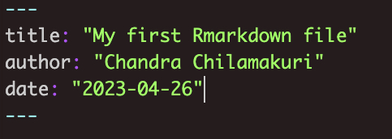
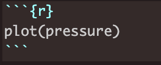
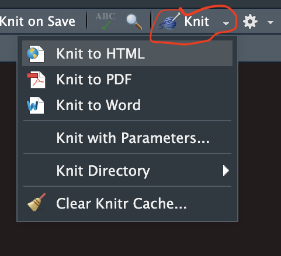

> #### Aims
>
> * To demonstrate the other R data structures like data frames, lists etc
> * To demonstrate the R markdown


## The structure of data in R continues


* R has many data structures. These include
  - [x] Atomic vector
  - [ ] factors
  - [ ] matrix
  - [ ] data frame
  - [ ] list
  

### Factors

* A factor is very similar to a vector
* Factors are used to represent categorical data such as , sex (male or female), tumour stage (stage 1, stage 2 ...)
* Factors are useful for statistical analysis and plotting

```{r}
x <- c("male", "female", "female", "male")
x
sex <- factor(x) # convert vector x into a factor
sex
```

* Once created, factors can only contain a pre-defined set values, known as levels.

```{r}
levels(sex) # what are the levels in sex object
nlevels(sex) # how many levels in sex object
```

* In R’s memory, these factors are represented by integers (1,2,3,4 ...)

```{r}
x <- c("low", "high", "medium", "high", "low", "medium", "high")
typeof(x) 
food <- factor(x) # convert x into a factor
levels(food) # get the levels
typeof(sex) 
food_relevel <- factor(x, levels = c("low", "medium", "high")) # re-level the levels
food_relevel
levels(food_relevel)
nlevels(food_relevel)
typeof(food_relevel)
```

* "is" family functions

  * Is function start with "is." like is.vector(), is.character()
  * Output of is family of functions is a logical value TRUE or FALSE

    * What type of data does the object contain?
      * typeof(): Indicates the type of data contained in the object 
      * is.character(): to test if the object holds character type data
      * is.double(): to test if the object holds decimal type data
      * is.numeric(): to test if the object holds numeric type data
      * is.integer(): to test if the object holds integer type data
      * is.logical(): to test if the object holds logical type data
  
    * What type of data structure does the object represent?
      * class(): Describes the type of data structure that the object represents
      * is.vector(): To determine if the object is a vector
      * is.factor(): To determine if the object is a factor
      * is.matrix(): To determine if the object is a matrix
      * is.data.frame(): To determine if the object is a data frame

```{r}
x <- 1:100
typeof(x)
is.integer(x)
is.vector(x)
is.factor(x)
```
* "as" family functions

  * For converting one data type to another data type or one data structure to another data structure
  * As function start with "as." like as.vector(), as.character()

    * Convert one data type to another data type
      * as.character(): convert to character type data
      * as.numeric() 
      * as.integer()
      * as.logical()
  
    * Convert one type of data structure to another
      * as.vector()
      * as.matrix()
      * as.factor()
      * as.data.frame()
    
```{r}
x <- 1:100
typeof(x)
y <- as.character(x)
typeof(y)

is.vector(x)
z <- as.matrix(x)
is.matrix(z)
```

### Matrices 

* In R matrices are an extension of the numeric or character vectors.
* As with atomic vectors, the elements of a matrix must be of the same data type.
* The matrix can be viewed as a collection of vectors
  * Matrix rows and columns are vectors
  * All the vectors hold identical data type
  * The vectors must have the same length
  

```{r}
x <- c(1:9)
is.vector(x)
typeof(x)
y <- matrix(data=1:9, nrow = 3, ncol = 3) # create a matrix 
class(y)
typeof(y)
```
* In contrast to vectors, matrices and data frames are two dimensional  data structures
  * First dimension: rows
  * Second dimension: columns

* dim(): Provides the dimensions of an object
* nrow(): gives number of rows
* ncol(): gives number of columns

```{r}
dim(y) # get dimensions of an object
nrow(y) # gives number of rows
ncol(y) # gives number of columns
```

* Unlike vectors, sub-setting requires both rows and columns to be provided
* Like vector subscript operator "[]" is used to access the values
* Unlike vector, matrix is a two dimensional data structure
* general syntax: matrix[ rows , columns ]

```{r}
y[] # gives all the values in a matrix
y[1,2] # get the value from 1st row and 2 columns
y[1,] # get all the values from 1st row
y[,3] # get all the values from 3rd column
y[c(1,3), c(2,3)] # get 1st and 3rd values from 2nd and 3rd column
```

* Like vector matrix can hold only one type of data, if we try to mix two are more different data type, R implicitly convert into one type

```{r}
typeof(y)
y
y[2,3]
y[2,3] <- "A" # replace 
y
typeof(y)
```


### Lists

* R’s simplest structure that combines data of different types is a list.
* A list is a collection of any data structures
* List can be of different types and different lengths.
* A list can be a collection of lists.
* Lists are very flexible data structures that can hold anything.

```{r}
my_first_list <- list(1:10, c("a", "b", "c"), 
                      c(TRUE, FALSE), 100, 
                      c(1.3, 2.2, 0.75, 3.8))
my_first_list
```

my_first_list has five elements and when printed out like this looks quite strange at first sight. Note how each of the elements of a list is referred to by an index within 2 sets of square brackets or one set of square. This gives a clue to how you can access individual elements in the list.

* How to access the elements from the list?
  * Using any one of the following three operator ...
    1. "[]": Standard subscript operator, works like in a vector. The output is still a list. 
    2. "[[]]": This operator can only take one index number at a time and the output will be the data structure for that element.
    3. "$": to extract an element from a list or a column from a data frame by name.


```{r}
length(my_first_list)
my_first_list[1] # get element one from the list
my_first_list[1:3] # get element one from the list
```


```{r}
length(my_first_list)
my_first_list[[1]] # get element one from the list
my_first_list[[5]] # get element one from the list
```

* Elements in lists are normally named

```{r}
named_list <- list( 
  city_name=c("Cambridge", "London", "Oxford"),
  population=c(1.62, 8.9, 1.5 ) )

named_list

named_list$city_name # equivalent to named_list[[1]]
named_list$population # equivalent to named_list[[2]]
```

* You can modify lists either by adding addition elements or modifying existing ones.

```{r}
named_list$city_name[2] <- "LONDON"
named_list
```


Lists can be thought of as a ragbag collection of things without a very clear structure. You probably won’t find yourself creating list objects of the kind we’ve seen above when analyzing your own data. However, the list provides the basic underlying structure to the data frame that we’ll be using throughout the rest of this course.

The other area where you’ll come across lists is as the return value for many of the statistical tests and procedures such as linear regression that you can carry out in R.

To demonstrate, we’ll run a t-test comparing two sets of samples drawn from subtly different normal distributions. We’ve already come across the rnorm() function for creating random numbers based on a normal distribution.

```{r}

sample_1 <- rnorm(n = 100, mean=5, sd=1)
sample_2 <- rnorm(n = 100, mean=7, sd=1)

result <- t.test(x=sample_1, y=sample_2)

is.list(result) # test if object is a list
result
names(result) # list names of the object
result$statistic
result$p.value
```

### Data frames

* A much more useful data structure and the one we will mostly be using for the rest of the course is the data frame. 
* This is actually a special type of list in which all the elements are vectors of the same length. 

```{r}
df <- data.frame( 
  city_name=c("Cambridge", "London", "Oxford"),
  population=c(1.62, 8.9, 1.5 ))
df
class(df)
dim(df)
```

* R provides many built-in data sets, most of which are represented as data frames.
* data(): lists all the avilable built-in data sets
* One popular data set is `iris`
* To know more about any data set, one can use `help()` or `?` to get help
* iris:
  * data frame with 150 observations (rows)  
  * 5 variables (columns)
    * Sepal.Length
    * Sepal.Width
    * Petal.Length
    * Petal.Width
    * Species
* To bring one of these internal data sets to the fore, you can just start using it by name.

```{r}
head(iris)
```


* You can also get help for a data set such as iris in the usual way.

```{r}
?iris # get help for iris data
```
* This reveals that iris is a rather famous old data set of measurements taken by the esteemed British statistician and geneticist, Ronald Fisher (he of Fisher’s exact test fame).

* A data frame is a special type of list so you can access its columns in the same way as we saw previously for lists.

```{r}
names(iris)
iris$Petal.Width # or equivalently iris[["Petal.Width"]] or iris[[4]]
```

* Viewing data frames is made easier with these functions
  * head(): Shows first 6 lines of a data frame
  * tail(): Shows first 6 lines of a data frame
  * View(): Shows data frame in excel like format

```{r}
head(iris)
```

```{r}
tail(iris)
```
```{r}
View(iris)
```

* In that last example we extracted the Petal.Width column which itself is a vector. We can further subset the values in that column to, say, return the first 10 values only.

```{r}
iris$Petal.Length[1:10]
```

* Matrix-like syntax can be used to access both rows and columns.
* df[ row index, column index]
```{r}
# df[ row index, column index]
iris[ 1:4, 1:3] # rows from 1 to 4 and columns from 1 to 3
iris[c(1,4,7), c(2,4)] #  rows from1,4 and 7 and columns from 2 and 4
```

* To extract values from a data frame, row/column names may also be used

```{r}
iris[c(1,4,7), c("Sepal.Width","Species" )] # iris[c(1,4,7), c(2,5)] 
```


* We can also use conditional sub-setting to extract the rows that meet certain conditions, e.g. all the rows with Sepal.Length of 5.

```{r}
iris[iris$Sepal.Length == 5, ]
```
* One can use & (and), | (or) and ! (not) logical operators for complex sub-setting.
```{r}
iris[iris$Sepal.Length == 5 & iris$Species == "setosa", ]
```

A data frame is the most common data structure you will encounter as a beginner. As you can see from the examples above, the syntax is tricky and not intuitive at all. In order to overcome this problem, R has a package called [tidyverse ](https://www.tidyverse.org/). The tidyverse package combines eight other packages into one. Two important packages in tidyverse are `dplyr` and `ggplot2`

* dplyr: Makes working with data frames fun and easy
* ggplot2: Creates beautiful plots with ease.

From next week you will be working with tidyverse.

* **`summary()`**  is a very useful function that summarises each column in a data frame

```{r}
summary(iris)
```


## R Markdown: a brief introduction

* Documents created with R Markdown can serve as a neat record of your analyses.
* Reproducible research aims to make your analysis easy to understand by other researchers 
* Using RMarkdown, you can view your code along with its output (graphs, tables, etc.) with conventional text to explain it, a bit like a notebook.

* Once RMarkdown file (.Rmd) is created, one can easily knit into different formats
  * html file
  * pdf file
  * doc file
  * slides

* An R Markdown file is made up of 3 basic components:
  * header: contains title, author, date etc
  * markdown: contains free text, images etc
  * R code chunks: contains actual R code
  
* Header:
  * The markdown document starts with an optional header in YAML format known as the YAML metadata.
  * In the example below the title, author and date are specified in the header. 
  
  
* R code chunks
  * This contains actual R code just like code in the R script
  * A comment can be added to a code by using "#"
  * below is the example R code chunk
  

* Markdown

  * The text following the header in an R Markdown file is in Markdown syntax.
  * This is the syntax that gets converted to HTML format once we click on the Knit button
  * The philosophy behind Markdown is that it should be easy to write and easy to read.
  * Within markdown, one can add text, add images, links etc

* 
  
*  Headings:
  * Heading can be created by stating the line with "#" symbol
  
    * \# Header 1

    * \#\# Header 2

    * \#\#\# Header 3


* Text type

  * **This is bold text** or __This is bold text__
  * *This is Italic text* or _This is Italic text_

* Create links
  * general syntax to create a link to a webpage use: `[text of link](web address)`
  * Example: `[This is link to bitesize R course](https://bioinformatics-core-shared-training.github.io/Bitesize-R/)` this is rendered as [This is link to bitesize R course](https://bioinformatics-core-shared-training.github.io/Bitesize-R/)

* Insert images

  * general syntax: ``
  * Example: ``


* Lists  

  \* Item 1  
  \* Item 2  
  \* Item 3


After the R markdown file has been prepared, save it and knit it to the desired document like shown below.



#### Credit

These instructions were adapted from following sources.

* [Data Carpentry](https://datacarpentry.org)

* [R Markdown tutorial](https://ourcodingclub.github.io/tutorials/rmarkdown/)

* [Reproducible Research in R](https://ac812.github.io/reproducibility-training/)


## Exercises


:::exercise

1. Using `mtcars` dataset answer the following.

    a. How many rows and columns in the `mtcars` data set?
    b. How many cars in the `mtcars` data set have 8 cylinders?
    c. How many cars in the `mtcars` data set have 6 cylinders and more than 3 gears?

<!---<details><summary>Answer</summary>

```{r ex_1, purl=FALSE}
# 1 a
nrow(mtcars)
ncol(mtcars)

# 1 b
sum(mtcars$cyl == 8)

# 1 c
sum(mtcars$cyl== 6 & mtcars$gear > 3)
```
</details> --->
:::


:::exercise

2. Extract 3rd and 5th rows with 1st and 3rd columns from `mtcars` data set.

<!---<details><summary>Answer</summary>

```{r ex_2, purl=FALSE}
mtcars[c(3,5), c(1,3)]
```
</details> --->
:::


:::exercise
3. From `airquality` data set
    a. Identify the data structure of the first row by extracting it?
    b. Identify the data structure of the first column by extracting it?

<!---<details><summary>Answer</summary>

```{r ex_3, purl=FALSE}
# 3 a
class(airquality[1,])

# 3 b
class(airquality[,1])
is.vector(airquality[,1])
is.data.frame(airquality[,1])
```
</details> --->
:::


:::exercise
4. Using `airquality` data set
    a. Show first 10 rows 
    b. Show last 2 rows
    c. list all the column names available

<!---<details><summary>Answer</summary>

```{r ex_4, purl=FALSE}
# 4 a
head(airquality, n=10)

# 4 b
tail(airquality, n=2)

# 4 c
names(airquality)
colnames(airquality)
# 3 b
class(airquality[,1])
is.vector(airquality[,1])
is.data.frame(airquality[,1])
```
</details>--->
:::


:::exercise
5. Using `airquality` data set, can you test Ozone production and solar radiation are correlated and answer the following. Hint: Use`cor.test` function.
    a. Get correlation coefficient confidence interval
    b. what is the p-value?
    c. What is the estimated correlation coefficient?


<!---<details><summary>Answer</summary>

```{r ex_5, purl=FALSE}
# 1 a
results <- cor.test(airquality$Ozone, airquality$Solar.R)
results$conf.int

# 1 b
result$p.value

# 1 c
results$estimate
```
</details>--->
:::


